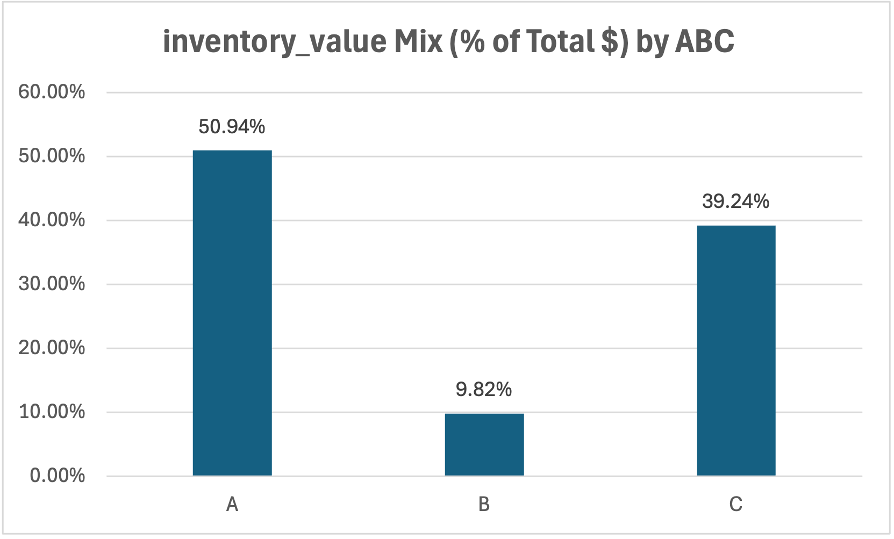
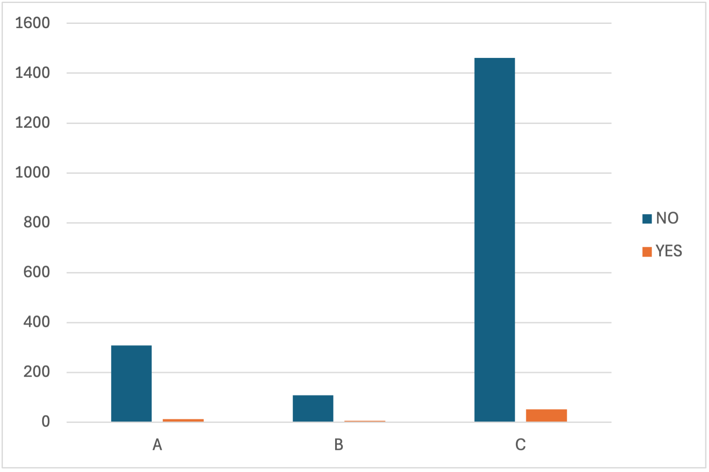
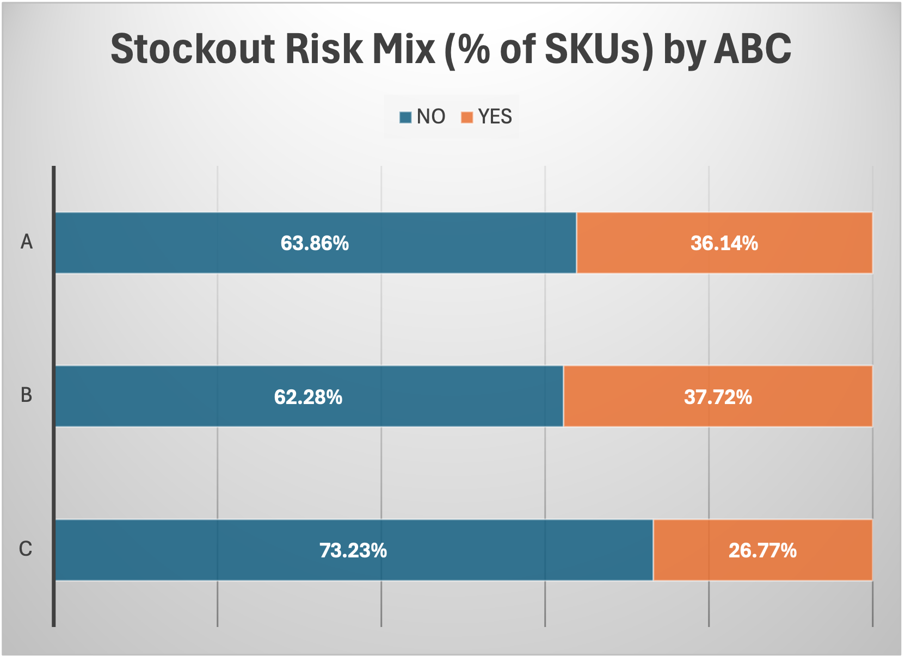
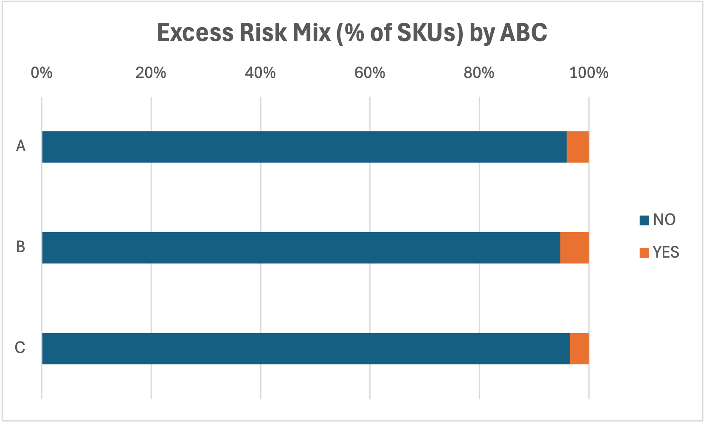

# Inventory Buy Plan Dashboard (Excel) — ABC + Risk Mix

## Overview
Built an Excel dashboard to support inventory buy planning using ABC segmentation and risk indicators.

## What I built
- ABC Mix (% of SKUs)
- Inventory Value by ABC
- Weeks of Supply by ABC
- Stockout Risk mix (YES vs NO) by ABC (100% stacked)
- Excess Risk mix (YES vs NO) by ABC (100% stacked)

## Dashboard Charts (Exported from Excel)
### ABC Mix (% of SKUs)

### Inventory Value by ABC

### Weeks of Supply by ABC

### Stockout Risk Mix (YES vs NO)

### Excess Risk Mix (YES vs NO)

## Tools/skills used
- Excel PivotTables (Count / Sum / Average)
- Show Values As → % of Row Total
- PivotCharts (Column + 100% stacked bar)
- Dashboard formatting + chart export for reporting

## Notes on data privacy
This repository shares only exported charts and screenshots for demonstration.
